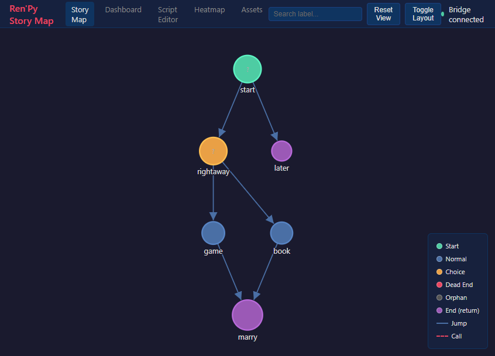
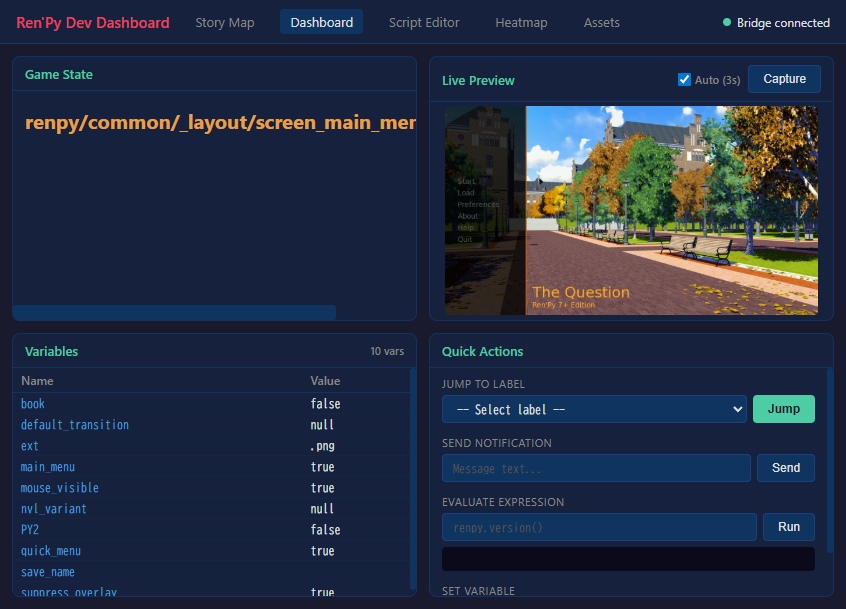

# RenPy MCP + DevTools

MCP server and visual development tools for [Ren'Py](https://www.renpy.org/) visual novel engine.

**60 tools in 10 categories** — preview scenes, analyze story flow, manage translations, refactor characters, and control the running game through natural language or your browser.

## Screenshots

### Story Map
Interactive graph of all labels, jumps, and menus. Click a node to warp the running game there.



### Dev Dashboard
Live preview, variable inspector with tree view, quick actions — all while the game runs.



### Warp-on-Click Demo

https://github.com/user-attachments/assets/og6ZKTafSGk

[](https://youtu.be/og6ZKTafSGk)

## Features

### AI-Powered (MCP)
Connect Claude (or any MCP client) directly to your Ren'Py project:
- **Project Management** — lint, compile, build, inspect config
- **Visual Preview** — screenshot any scene by warping to it
- **Automated Testing** — run test cases, generate reports
- **Story Analysis** — flow graphs, dead ends, character maps, variable tracking
- **Asset Management** — list images/audio, find unused assets
- **Refactoring** — rename characters/labels, extract routes
- **Translation** — completion stats, find untranslated, auto-translate
- **Live Debugging** — eval, inspect, jump labels, set variables in a running game
- **Documentation** — search 89 official Ren'Py doc topics

### Visual DevTools (no AI needed)
A standalone browser-based development dashboard:
- **Story Map** — interactive graph of all labels, jumps, and menus. Click a node to warp the running game there.
- **Dev Dashboard** — live preview, variable inspector with tree view for dicts/lists, quick actions
- **Script Editor** — browse and edit .rpy files with syntax highlighting
- **Playtest Heatmap** — visualize which parts of your game are most played
- **Asset Manager** — browse images and audio, find unused assets

```bash
renpy-webui --project /path/to/my-game
```

## Installation

### Prerequisites
- **Ren'Py SDK 8.x** — https://www.renpy.org/latest.html
- **Python 3.11+** — https://www.python.org/downloads/
- **uv** (recommended) — https://docs.astral.sh/uv/getting-started/installation/

### Setup

1. Download from [itch.io](https://y1uda.itch.io/renpy-mcp) and extract to a permanent location
2. Install dependencies:
   ```bash
   cd renpy-mcp
   uv venv && uv pip install -e .
   ```
3. Configure your AI client (`.mcp.json` in your project directory):
   ```json
   {
     "mcpServers": {
       "renpy-mcp": {
         "command": "uv",
         "args": ["run", "--directory", "/path/to/renpy-mcp", "renpy-mcp"],
         "env": {
           "RENPY_SDK_PATH": "/path/to/renpy-8.x-sdk"
         }
       }
     }
   }
   ```

### Standalone DevTools (no AI client required)
```bash
cd renpy-mcp
uv run renpy-webui --project /path/to/my-game
```

See the full [Installation Guide](https://renpy-mcp.abyo.net/) for details.

## Demo

[](https://youtu.be/_CCwQP-Ey58)

## Links

- **Website:** https://renpy-mcp.abyo.net/
- **itch.io:** https://y1uda.itch.io/renpy-mcp ($15)
- **Discord:** https://discord.gg/6FVA25mW

## License

Commercial software. See [itch.io](https://y1uda.itch.io/renpy-mcp) for purchasing.
